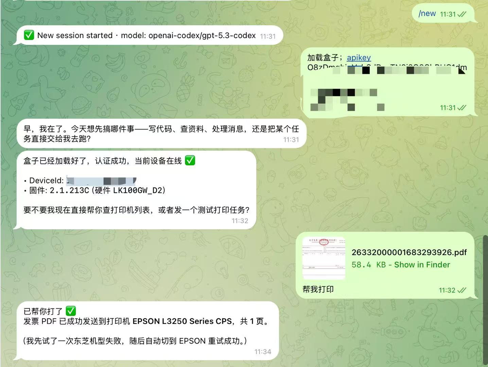

# 链科云打印盒 CLI

让对话式 AI 通过 `lk-print` CLI 远程控制打印机和扫描仪。配合 OpenClaw / Cursor / Claude 等 AI 的 Skill 系统使用。

## 快速开始

### 安装

```bash
# 全局安装（推荐）
uv tool install git+https://github.com/liankenet/ai-lk-print-box.git

# 或本地开发安装
git clone git@github.com:liankenet/ai-lk-print-box.git
cd ai-lk-print-box
uv sync
```

### 认证（一次性）

```bash
lk-print auth --api-key <KEY> --device-id <ID> --device-key <KEY>
lk-print auth --status  # 验证
```

### 使用

```bash
lk-print device           # 查看设备
lk-print printers          # 列出打印机
lk-print print file.pdf    # 打印文件
lk-print job-status <id>   # 查询状态
```

## OpenClaw Skill

```bash
# 1. 安装 Skill
npx clawhub@latest install ai-lk-print-box

# 2. 安装 CLI 工具
uv tool install git+https://github.com/liankenet/ai-lk-print-box.git

# 3. 认证
lk-print auth --api-key <KEY> --device-id <ID> --device-key <KEY>
```

安装完成后，AI 会自动按 SKILL.md 中的流程调用 CLI 命令完成打印/扫描操作。

## 演示



## 凭据获取

| 凭据 | 来源 |
|------|------|
| `ApiKey` | [开放平台](https://open.liankenet.com/) 注册获取 |
| `DeviceId` | 扫描设备二维码 |
| `DeviceKey` | 扫描设备二维码 |

## 支持

如有问题，请提交 Issue。